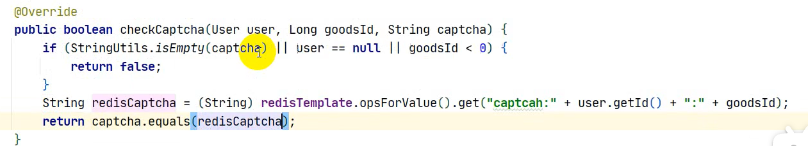

# seckill
a simple second kill project, use SpringBoot，Mybatis、Redis、RabbitMQ

## 分布式session的解决
1.当使用分布式的时候， 使用niginx作为网关，进行负载均衡。同一个request可能进到不同的服务器中。如何保证获取session的一致性呢？
这就是分布式session的要解决的问题。

2.常见的解决策略：分为两种，多个tomcat服务器之间同步维护或者创建一个单独地tomcat服务器作为session节点。

**粘性session**：  
apache服务器会把某个用户的请求，交给tomcat集群中的一个节点，以后此节点就负责该保存该用户的session，如果此节点挂掉，那么该用户的session也会消失。    
**非粘性session**：  这种方式下，NGINX通过负载均衡器根据节点的情况，把用户的请求进行分发，复制多份session给多个节点，这样，如果节点中其中一个session挂掉的话，其它的还能继续工作，也就是只要有一个节点没有挂掉，该用户的信息就不会消失。


粘性另解： 这里可以使用redis来进行cookie的存取。

## redis持久化的两种策略

### RDB
快照、两次RDB之间redis服务器发生宕机，会发生数据丢失。RDB的持久化是基于时间的。相比于AOF，可以在宕机之后快速进行数据的恢复。

### AOF
记录操作；

命令--缓冲区--读取到AOF文件，更少可能发生数据丢失现象；

持续性的读取会带来额外的IO压力；文件一般比RDB大，因为同一条数据RDB只有一个记录，而AOF可能有多个操作；


### 持久化策略：RDB + AOF
首先使用RDB，因为当Redis宕机，RDB重启恢复的速度更快。然后使用AOF，把RDB的时间戳之后的操作，写入到Redis数据库之中。


## 技术短板
1. SpringMVC（WebMvcConfigurer、ArgumentAdaptor不太懂），本项目通过它实现了：

本来： session--传入控制层  --获取-user-

现在:   User(参数，Adapter监听)---监听到处理----传入到Controller


## 提高秒杀QPS的方式


### 什么是QPS？

“qps（query per second）意思是每秒查询率，是计算机中服务器每秒能够相应的查询次数，qps是对一个特定的查询服务器在规定时间内所处理流量多少的衡量标准。”


### 提高QPS的方式


---

使用缓存。 对于一些多读少写的数据，使用redis缓存来进行存储。 每次访问的是redis缓存而不是后台的数据库。


使用前后端分离技术， 不需要每次向前端传送一个HTML页面，而是传送json数据。 数据在前端渲染。


## 秒杀效果提高


1. 使用前后端分离技术， 每次向前端传送json数据而不是一整个HTML页面。
2. 在秒杀前， 需要判断库存。 这时候是到后台数据库中找。 **修改为**：在redis中找。 （每次秒杀生成订单的时候把记录存入redis缓存中）。redis因为是内存，检索速度更快。


## 解决超卖问题

1. 每次扣库存的时候（是一条sql语句）， 在这条语句的同时进行库存量的判断，如果库存量小于1，则不进行减库存操作。

   ```java
   boolean hasUpdated = seckillGoodsService.update(
           new UpdateWrapper<SeckillGoods>()
                   .eq("goods_id", goods.getId())
                   .gt("stock_count", 0)
                   .setSql("stock_count = stock_count - 1"));
   //如果更新失败，返回false。通过这个false， 抛出GlobalException，被ExceptionHandler拦截，返回错误信息到前台。
   ```

   


## 秒杀效果的再次提高

1. 把商品放在redis缓存中，这样直接减少对数据库的访问。
2. 对于订单的生成过程（秒杀商品订单、普通商品订单）放在rabbitMQ中进行异步生成。


## Redis实现分布式锁

### 1 第一版

仅仅使用set not exist， 返回boolean类型数据。 为true， 就是获取了锁。 

只有获取锁的线程可以进行进一步操作。操作完成后释放锁。


**缺点**：如果A得到了锁， 在释放锁之前出现了异常，会出现死锁问题。


### 2 第二版

对于锁设置过期时间。 这样即使出现了异常，过了过期时间也会进行锁的释放。不会出现死锁问题。但是会带来新的问题


**缺点**： 两个线程， A和B。 设置锁的过期时间是5S。

A： 获取锁， 完成时间是7秒。

B： 在第五秒的时候，锁自动释放。 这时候B获取锁， 正在执行过程中， A完成了任务，把B的锁释放掉了。


### 3 第三版： 对第二版问题的解决

方式： 同一个锁， 不同线程获取有不同的value值（可以用UUID生成随机值），每次删除的时候要必须要value值匹配。


## 安全问题

### 1 概述

当我们想要去使用秒杀来进行营销活动的时候， 可能有黄牛使用脚本、调用接口来进行快速秒杀，这样就无法实现我们的营销目的。所以， 解决安全问题防止脚本 + 阻止脚本对数据库的频繁刷新。让程序按照自己想要的方向运行。


### 2 各种概念


隐藏秒杀接口。


验证码。 验证码有两个好处： 1,防止脚本操作， 在操作之前要做额外的行为。 2.增加秒杀时间， 现在秒杀  = 填写验证码 + 秒杀的时间， 这样就起到了一个消峰的作用。


验证码分为两个部分： 生成、验证。

以下是生成验证码部分


前台通过点击验证码区域，  然后会向后台发送一个请求。  /captcha?goodsId = goodsId。 response发送到前台， 然后解析形成图片。 用户填写验证码， 结果会返回到后台进行匹配验证。

注意： 验证信息可以使用session进行存储。

`redisTemplate.opsForValue().set("captcha:" + user.getId() + ":" + goodsId,captcha.text(),300, TimeUnit.SECONDS)`


也就是， 生成一个验证码。 然后把值存入redis之中。然后有一个验证的过程， 会通过userId等信息到redis数据库中找该验证码， 和前台传入的、用户写的验证码进行匹配。




